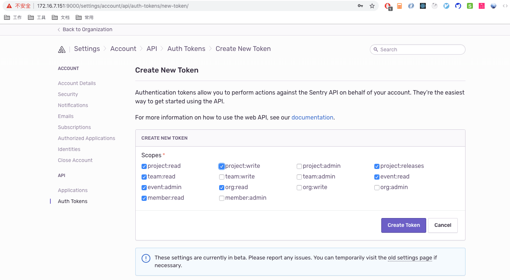

# 自建 Sentry

## 1. 安装 Docker

- **Mac**

  直接官网下载 `.pkg` 文件进行安装。安装完毕后查询版本。

```shell
docker --version
# Docker version 18.06.1-ce, build e68fc7a

docker-compose --version
# docker-compose version 1.22.0, build f46880f
```


- **Linux**

```shell
# 安装 Docker
yum install docker -y

# 安装 Docker-Compose
pip install docker-compose

# 如果 pip 命令被禁用了，使用下面方式下载二进制文件，并赋权
sudo curl -L "https://github.com/docker/compose/releases/download/1.24.1/docker-compose-$(uname -s)-$(uname -m)" -o /usr/local/bin/docker-compose
#赋权
sudo chmod +x /usr/local/bin/docker-compose

# 启动 Docker
systemctl start docker
```

## 2. 开始搭建

### 2.1 拉取 sentry-onpremise

```shell
git clone https://github.com/getsentry/onpremise.git
```


### 2.2 创建服务端服务

```shell
# 进入 onpremise 项目
cd onpremise

# 新建本地数据库和 Sentry 配置的目录
docker volume create --name=sentry-data && docker volume create --name=sentry-postgres

# 创建环境变量配置文件
cp -n .env.example .env

# 编辑 .env 文件，添加sentry_image对应版本，不然 build 时会报错，找不到SENTRY_IMAGE的值 
# SENTRY_IMAGE=sentry:9.1.2
vim .env

# 编辑 sentry.conf.py 添加额外的 sentry 功能
vim sentry.conf.py
# 新增内容
# Enables the Discard and Delete feature
SENTRY_FEATURES['projects:discard-groups'] = True
# Enables the Custom Inbound Filters feature
SENTRY_FEATURES['projects:custom-inbound-filters'] = True

# 构建 Docker Services
docker-compose build

# 生成秘钥
docker-compose run --rm web config generate-secret-key

# 复制秘钥(即最后一行)，编辑 .env 文件，将 SENTRY_SECRET_KEY 对应的 value 修改为刚才复制下来的秘钥
vim .env

# 创建数据库，生成管理员账号
# 注意：1. 这里要保证当前服务器或者本机至少有 3G 的空闲内存，否则不能完全执行
#      2. 当创建完 postgres 后会让你创建账户和密码，用于登录 sentry
docker-compose run --rm web upgrade

# 启动 Sentry 服务
# 如果没有报错，那说明 Sentry 服务已经启动成功，可以访问 localhost:9000 进入 sentry
docker-compose up -d

# 查看容器
docker-compose ps
```


## 3. 配置系统

访问 `localhost:9000` 进入 sentry 

- Root URL: 安装完后记得设置 `根网站地址`，并且 `根网站地址` 必须和搭建的 Sentry 域名一致
- Admin Email: 系统管理员的邮件地址

重新配置：

- Admin => Settings => General => Root URL(example: [http://192.168.2.68:9000](http://192.168.2.68:9000/))


##  4. 删除服务

```shell
# 停止所有运行
docker-compose down

# 移除所有 volume
docker volume prune
```


## 5.邮箱设置

在搭建好的 Sentry 的 Web 页面中无法配置邮箱 smtp 信息，需要修改配置文件 config.yml。

- **config.yml**

```yaml
###############
# Mail Server #
###############

mail.backend: 'smtp' # Use dummy if you want to disable email entirely
mail.host: 'smtp.live.com' # 输入邮箱 smtp 服务器地址
mail.port: 587
mail.username: 'xujun1019@hotmail.com'
mail.password: 'paramore123'
mail.use-tls: true
```


- **docker-compose.yml**

为其中的 Web 容器添加 volumes 卷，使得 config.yml 修改生效

```yaml
 web:
    <<: *defaults
    ports:
      - '9000:9000'
    volumes:
      - ./config.yml:/etc/sentry/config.yml # 将 config.yml 添加进 volumes 中
```


- **重启服务**

```shell
# 关闭服务
docker-compose down

# 启动服务
docker-compose up -d
```


- **邮件发送规则**

  可以进入项目，在设置中的警报项配置规则，如果不想发送测试版本的数据，设置 `Release: staging` 即可。

## 6. sentry-cli

可用于配置 SourceMap、控制 Release 等。可以自动配置项目中的`.sentryclirc`文件，用于将项目和 sentry 中创建的项目关联

- **安装**

```shell
npm install sentry-cli-binary -g
```


- **生成 token**

  `User settings => API => Auth Tokens => Create New Token` 生成 token，注意要勾选` project:write`，开启项目的写权限。

  


- **登录 cli**

  > 注意：需要在当前项目的根目录中先创建`.sentryclirc`文件，然后在项目根目录中执行以下命令，`.sentryclirc`文件内容可以不填写，执行命令后会自动填充

  - **.sentryclirc**文件内容

  ```shell
  [defaults]
  project=ams	# 在 sentry 中设置的项目
  org=sentry # 在 sentry 中的组织
  url=http://192.168.2.68:9000 # sentry 项目的根地址
  
  [auth]
  token=abdb8f22746647569fa5aa4b45d0e61cfd49d34c93ac495ea52ac4acdaba213c # 在 sentry 中生成的 token
  ```

  - 执行命令，更新`.sentryclirc`文件数据

  ```shell
  # 注意要制定 --url，否则会指到官网
  sentry-cli --url http://127.0.0.1:9000 login
  
  # 输入上一步生成的 token
  ```


## 7. 在项目中配置 Sentry SDK &上传 SourceMap

上传的方式有多种。可以通过 `sentry-cli` 通过命令行的方式来上传 `source-map`，但是需要手动上传。也可以采用 `webpack-plugin` 这个插件，可以在 `build` 的同时自动上传 `source-map`。推荐采用自动上传策略。

- 安装插件

```shell
# 安装 Sentry SDK
npm i @sentry/integrations @sentry/browser -S

# 安装 上传 SourceMap 插件
npm install @sentry/webpack-plugin -D
```


- 打包命令配置

```shell
npm run build -- IP="192.168.3.21:9090" SENTRY_ENV="DEV" RELEASE_VERSION="1.0.0"
```


- 打包参数获取

```js
// prod.env.js

// 获取 npm run build 后传入的参数
const args = process.argv.splice(2)

// 将传入的参数设置到 process.env 上
args.forEach(item => {
  const params = item.split('=')
  process.env[params[0]] = params[1]
})

// 将变量导出，用于 webpack 配置中使用
module.exports = {
  RELEASE_VERSION: `"${process.env.RELEASE_VERSION}"`,
  IP: `"${process.env.IP}"`,
  SENTRY_ENV: `"${process.env.SENTRY_ENV}"`
}
```


- Sentry SDK 配置

```js
// main.js

import * as Sentry from '@sentry/browser'
import * as Integrations from '@sentry/integrations'

process.env.NODE_ENV === 'production' &&
Sentry.init({
  // dsn 在 sentry 中创建项目时会自动给出 dsn 地址，直接复制即可
  dsn: 'http://1a120486c8ce47a2857596a3c8ef7a18@192.168.2.68:9000/2',
  integrations: [
    new Integrations.Vue({
      Vue,
      attachProps: true
    }),
    new Integrations.RewriteFrames()
  ],
  release: process.env.RELEASE_VERSION, // 打包命令中传入的版本号
  environment: process.env.SENTRY_ENV  // 打包命中中传入的环境名，在 sentry 中可用于区分错误在哪个环境发生的
})
```


- 上传 SourceMap 插件配置：

```js
// webpack.prod.conf

const SentryCliPlugin = require("@sentry/webpack-plugin");
plugins:[
    new SentryCliPlugin({
        include: path.join(__dirname, '../dist/static/js/'),
        release: process.env.RELEASE_VERSION, // 可以在执行打包命令时传入，进行版本配置
        configFile: 'sentry.properties', // 指定 config 文件为 .sentryclirc 文件
        ignoreFile: '.sentrycliignore',
        ignore: ['node_modules', 'webpack.config.js'],
        urlPrefix: `http://${process.env.IP}`	// 这里是你的项目的根地址，用于在 sentry 中映射，这里也做成了可配置形式
    })
]
```


- 删除某个版本的 SourceMap

```shell
# 在本机的项目根目录运行
# $release 为版本号
# 例：sentry-cli releases files ams@1.0.0 delete --all
sentry-cli releases files $release delete --all
```


## 8. 清除 postgres 数据，释放磁盘空间

- 手动清除

```shell
# 利用 sentry 的清除工具清除
docker exec -it onpremise_web_1 sentry cleanup --days 7
# 再运行df -h 发现还是很满。这是因为cleanup的使用delete命令删除postgresql数据，但postgrdsql对于delete, update等操作，只是将对应行标志为DEAD，并没有真正释放磁盘空间。

# 清除 postgres 中的无效数据
docker exec -it onpremise_postgres_1 vacuumdb -U postgres -d postgres -v -f --analyze
```

- 定期清除

> 每天清理超过7天以上的数据

```shell
crontab -e # 使用 crontab 在linux实现定时任务

# 在里面输入
0 0 * * *  docker exec -it onpremise_web_1 sentry cleanup --days 7  && docker exec -it onpremise_postgres_1 vacuumdb -U postgres -d postgres -v -f --analyze
```
 

